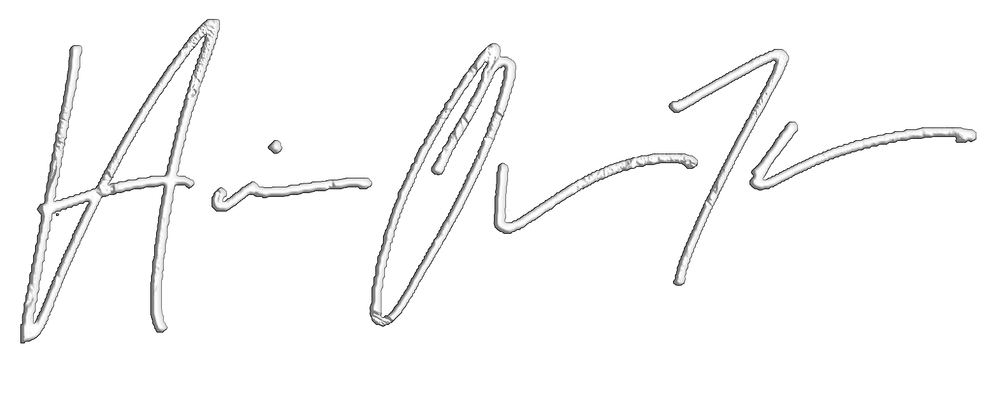

<p align="center">
  
</p>

<h1 align="center">🔥 Convos with HOT: Spinner Edition 🔥</h1>

<p align="center">
  Interactive question spinner designed for creators, fans, and wild interviews at Exxxotica and beyond.
</p>

<p align="center">
  <a href="https://himovertherestudios.github.io/convos-with-hot-spinner/" target="_blank">
    🌀 Try the Live Spinner Now
  </a>
</p>

---

## 🎯 What This Is

This is a mobile-friendly, animated prompt spinner built for quick Q&A segments under the **Convos with HOT** brand.  
Perfect for use during interviews, events, adult expos, podcast appearances, or fan meetups.

## 💻 Live Demo

👉 [https://himovertherestudios.github.io/convos-with-hot-spinner/](https://himovertherestudios.github.io/convos-with-hot-spinner/)

## ✨ Features

- 🔥 Category-based prompt filtering
- 🌀 Animated fade-in question effect
- 📱 Fully mobile-optimized
- 🎨 Custom branding: fonts, logo, background, footer
- 🧠 Over 50 spicy, fun, or deep questions

## 📁 File Structure

```
├── index.html            # Main HTML
├── style.css             # Styling and branding
├── script.js             # Spinner logic and questions
├── wm2018_white_3d.png   # Signature logo
```

## 🧠 Built For

- Event hosts
- Content creators
- Podcast interviewers
- Fans who want to break the ice 👀

## 🚀 Powered by
**[Him Over There Studios](https://www.himoverthere.com)**  
Follow: [@himovertherestudios](https://instagram.com/himovertherestudios)

---
